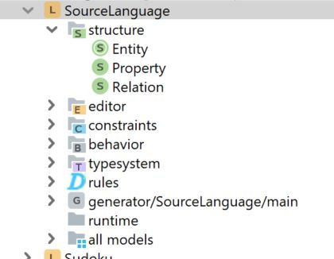
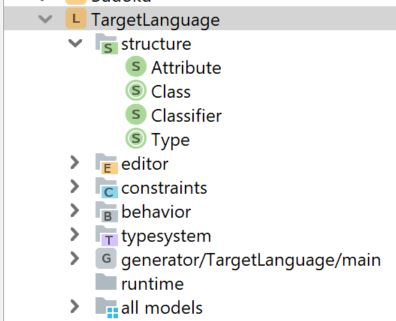
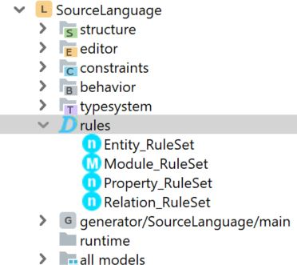
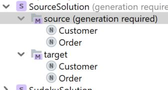

# DclareForMPS
DclareForMPS adds an language aspect named 'rules' to MPS.  
A rule typically derives some part of a model.  
Rules can trigger other rules.  
A rule runs when something changes in the models that is read by this rule (reactive).  The system terminates on a fixpoint (if no changes occur anymore).  
The regular MPS base-language can be used to specify the rules.  
Rules definitions typically use quotations (simple or not) to define the derivations.  
The rules are executed incrementally, meaning they perform a minimal amount of changes to derive the defined patterns (expressed in quotations).

## Build

## Installation
In an installed MPS (2018.3 or higher), install the DclareForMPS.zip plugin and extract the ExamplesProject.zip and open the extracted folder as a Project in MPS.

## Examples
Two examples can be found in the ExamplesProject:

### Entity to Class transformation
In this example two Languages are defined, the (Entity) SourceLanguage:
  

and the (Class) TargetLanguage:  

Rules are defined to transform instances of the Entity Language to instances of the Target Language:

Two example entities (instances of the SourceLanguage) are also provided:  

The classes in the SourceSolution/target folder will be 'generated' by the defined Rules.   
Please experiment with editing the source entities and check how the rules (reactively) change the target classes.
Also when a new entity is created in the source folder, it will immediately be transformed to a class in the target folder.

### Sudoku
