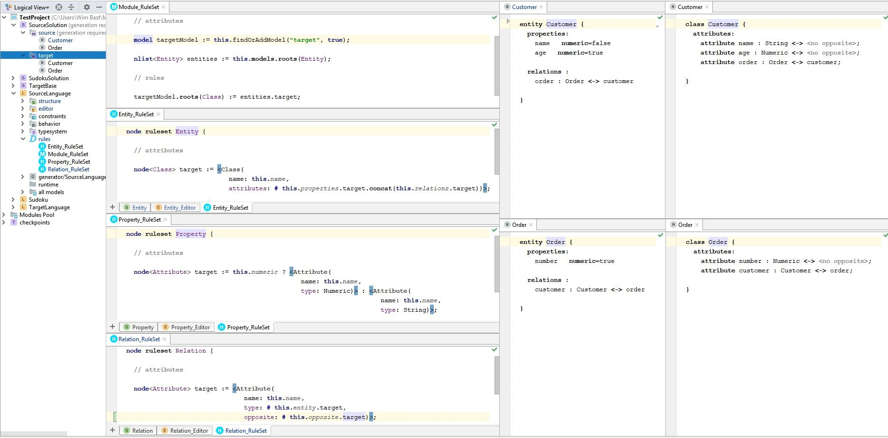
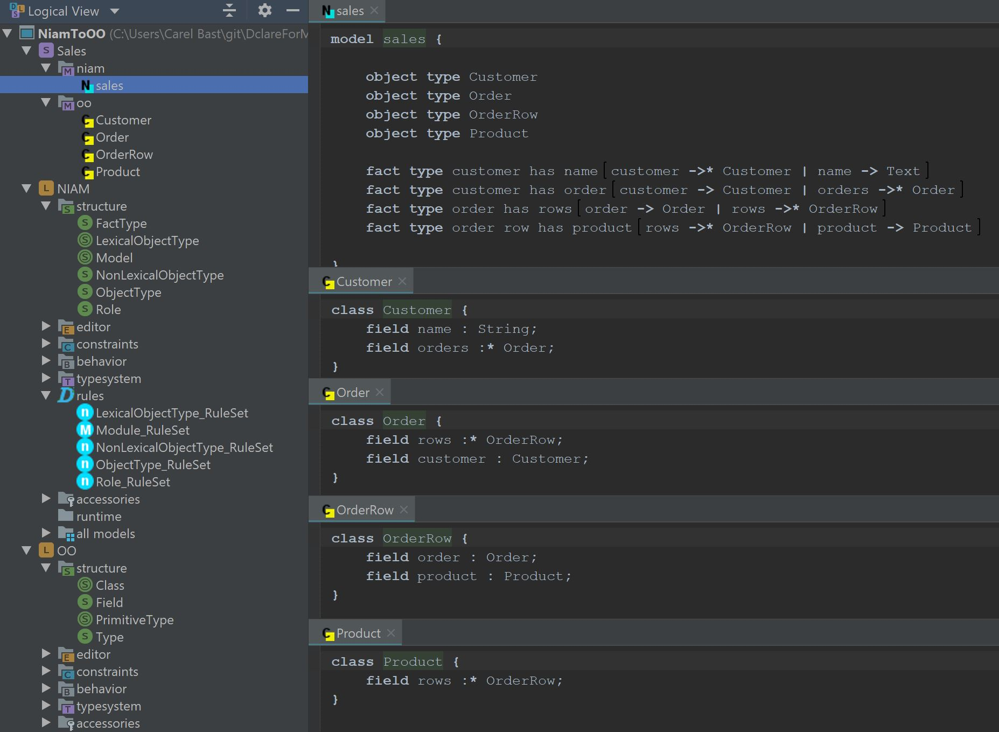
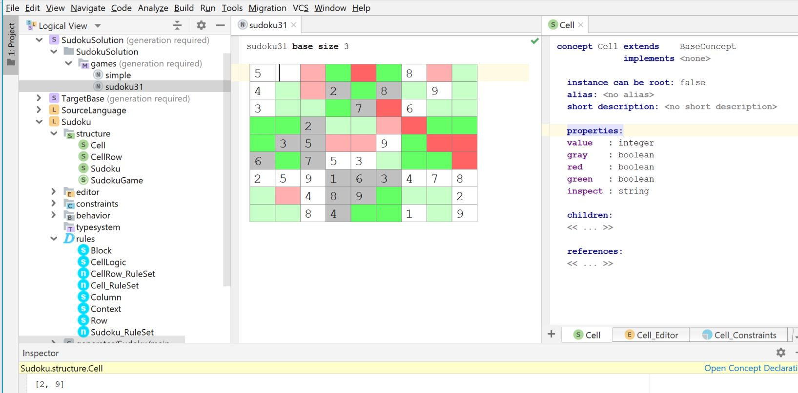

# DclareForMPS
DclareForMPS adds a language aspect named 'rules' to MPS.  
A rule typically derives some part of a model.  
Rules can trigger other rules.  
A rule runs when something changes in the models that is read by this rule (reactive).  The system terminates on a fixpoint (if no changes occur anymore).  
The regular MPS base-language can be used to specify the rules.  
Rules definitions typically use quotations (light or not) to define the derivations.  
The rules are executed incrementally, meaning they perform a minimal amount of changes to derive the defined patterns (expressed in quotations).

## Work in progress
DclareForMPS is a work in progress. In this phase of development, no guarantees are given on the stability and scalability of the software.  
All feedback, functional or technical, is appreciated.

## JDclare
DclareForMPS uses the transactions framework and the collections library that are part of the JDclare project.  
The JDclare project can be found here: [JDclare on GitHub](https://github.com/ModelingValueGroup/jdclare)

## Installation
In an installation of JetBrains MPS (2018.3 or higher) ...
1. install the DclareForMPS.zip plugin
2. open one of the example MPS Projects from [DclareForMPS_Examples on GitHub](https://github.com/ModelingValueGroup/DclareForMPS_Examples)
3. switch on the Dclare engine (Settings... > Dclare)
  
4. rebuild the example project

## Examples
Multiple examples can be found in the DcalreForMPS_Examples repository on GitHub:
[DclareForMPS_Examples on GitHub](https://github.com/ModelingValueGroup/DclareForMPS_Examples)

### 1. SourceTarget - a simple Entity to Class transformation
In this example two Languages are defined, the (Entity) SourceLanguage:
  

and the (Class) TargetLanguage:  

Rules are defined that transform instances of the Entity Language to instances of the Target Language:

Two example entities (instances of the SourceLanguage) are also provided:  

The classes in the SourceSolution/target folder will be 'generated' by the defined Rules.   
Please experiment with editing the source entities and check how the rules (reactively) change the target classes.
Also when a new entity is created in the source folder, it will immediately be transformed to a class in the target folder.
(Note that no generation is required to transform the model!)

Overview of this complete Example:

### 2. NiamToOO - a simple Niam to OO transformation

Similar to example 1, this example defines two languages with a transformation: 
* a NIAM like language   
* and a very basic OO language  
* Rules are defined to transform NIAM instances into OO instances  
* An example sales model is defined  

Overview of the sales example in NIAM and OO:

### 3. Sudoku - a Sudoku puzzle solver
The Sudoku example is a more sophisticated example that uses Rules to solve a Sudoku puzzle.

The Sudoku Structure and Rules are defined in the Sudoku Language.

There are two example Sudoku game instances delivered in the SudokuSolution/games folder.

The sudoku31 example:

