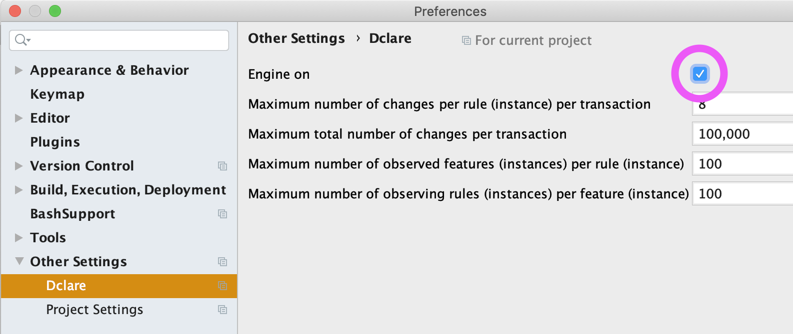

DclareForMPS  
================================
DclareForMPS adds a language aspect named 'rules' to MPS.  
A rule typically derives some part of a model.  
Rules can trigger other rules.  
A rule runs when something changes in the models that is read by this rule (reactive).  
The system terminates on a fixpoint (if no changes occure anymore).  
The regular MPS base-language can be used to specify the rules.  
Rules definitions typically use quotations (light or not) to define the derivations.  
The rules are executed incrementally, meaning they perform a minimal amount of changes to derive the defined patterns (expressed in quotations).

## Alpha phase
DclareForMPS is in progress.
We are working hard to publish the 1.0 version soon. It will then be available as a standard plugin in MPS, without the need to download it here.  
All feedback, functional or technical, is appreciated.

## JDclare
DclareForMPS uses the transactions framework and the collections library that are part of the JDclare project.  
The JDclare project can be found here: [JDclare on GitHub](https://github.com/ModelingValueGroup/jdclare)

## Installation
In an installation of JetBrains MPS (2019.2 or higher) ...  
1. install the DclareForMPS.zip plugin  
2. open one of the example MPS-Projects (see below)
3. switch on the Dclare engine (Settings... > Dclare)  
  
4. rebuild the example project  

## Examples
Multiple MPS-project examples can be found on GitHub:

[Sudoku on GitHub](https://github.com/ModelingValueGroup/Sudoku)

[EntityClassJava on GitHub](https://github.com/ModelingValueGroup/EntityClassJava)

[NiamToOO on GitHub](https://github.com/ModelingValueGroup/NiamToOO)

[FlattenAndCopy on GitHub](https://github.com/ModelingValueGroup/FlattenAndCopy)

For more info, please read the README.md files that are part of these examples.
