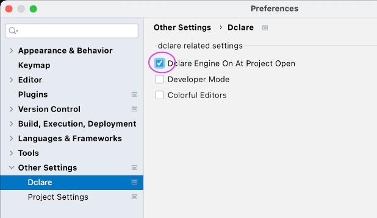

DclareForMPS  
================================
DclareForMPS adds a language aspect named '_rules_' to MPS.  
A rule typically derives some part of a model.  
Rules can trigger other rules.  
A rule runs when something changes in the models that is read by this rule (reactive).  
The system terminates on a fixpoint (if no changes occure anymore).  
The regular MPS base-languages can be used to specify the rules.  
Rules definitions typically use quotations (light or not) to define the derivations.  
The rules are executed incrementally, meaning they perform a minimal amount of changes to derive the defined patterns (
expressed in quotations).

## Standard MPS plugin

DclareForMPS is in constant progress. It is available as a standard plugin in MPS, without the need to download it here.
All feedback, functional or technical, is appreciated.

## dclareForJava

DclareForMPS uses the dclare engine of the Modeling Value Group.  
The dclare project can be found here: [dclare on GitHub](https://github.com/ModelingValueGroup/dclare)

## Installation

1. install JetBrains MPS (2020.1 or higher)
2. start MPS
3. go to the plugins preferences section and install DclareForMPS from the Marketplace
4. open one of the example projects (see below)
5. verify that the 'On' setting is enabled (Settings > Other Settings > Dclare):

4. rebuild the example project
5. play with the sandbox-models in the example-project

## Examples

Multiple examples can be found on GitHub:

- [Sudoku](https://github.com/ModelingValueGroup/Sudoku)
- [EntityClassJava](https://github.com/ModelingValueGroup/EntityClassJava)
- [NiamToOO](https://github.com/ModelingValueGroup/NiamToOO)
- [FlattenAndCopy](https://github.com/ModelingValueGroup/FlattenAndCopy)

For more info, please read the _README.md_ files that are part of these examples.
