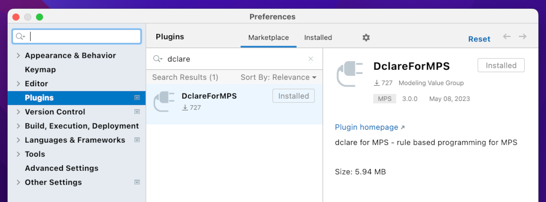
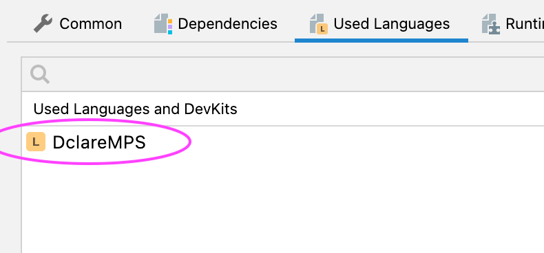
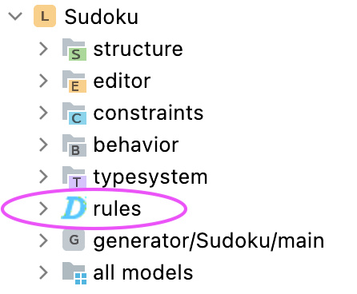
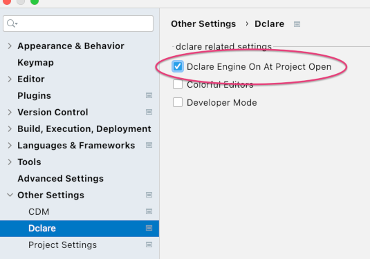
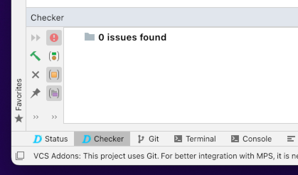

# Getting started

### Plugin Installation

You can install the plugin from the Jetbrains plugin Marketplace:

### Where to find the various parts of the plugin

When installed you can find the plugin in various places.

- create a language and add _DclareMPS_ as a used language or add the _DclareMPS_ plugin to an existing language:

  

- you will see a new MPS aspect has added called _Rules_. Under this aspect you will create and edit your rules.

  

- you will see that a preference pane with the name _Dclare_ has been added:

  

- you will see that a new tool has been added called _Status_:

  

- you will see that a new tool has been added called _Checker_:

  

### Helloworld

# Syntax

### Rule

### Attribute

### Method

### Node/Model/Module/Repository

### Struct

### Equation

### Rule Aspect

### Ruleset

### Node Construction

### Model Construction

### Error/Warning/Info Construction

### Reference Opposite

### Quotation Label

### List Literal

### Native Block

### Checked Dot Expression with Else

### Expression Tracing

# Settings

### Developer Mode

### Engine Auto On

### Thresholds

### Synchronisation

### Tracing

# Status Tool

### Messages

### Status

### Aspects

### Debugging

### Hotspot analyse

# Auto Checking

### Checking Settings

### Checking Tool

# Semantics

### Declarative

### Fixpoint

### Reactive

### Ripple Out

### Incremental

### Identity Matching

### Update Granularity

### Null Handling

### Exception Handling

### Orphan Handling

### Containment

### Optionality

### Constant Functionality

# Gui Library

The GUI library is an MPS language that allows you to create Swing GUIs in a declarative way.
The library is documented [here](GUI).
